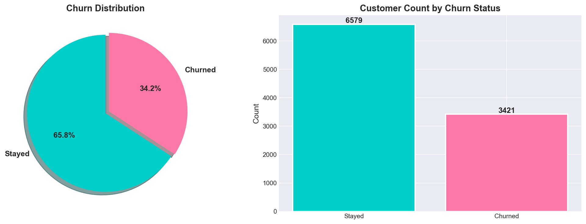
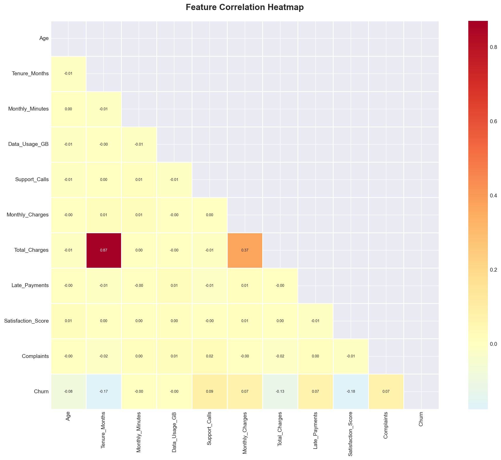
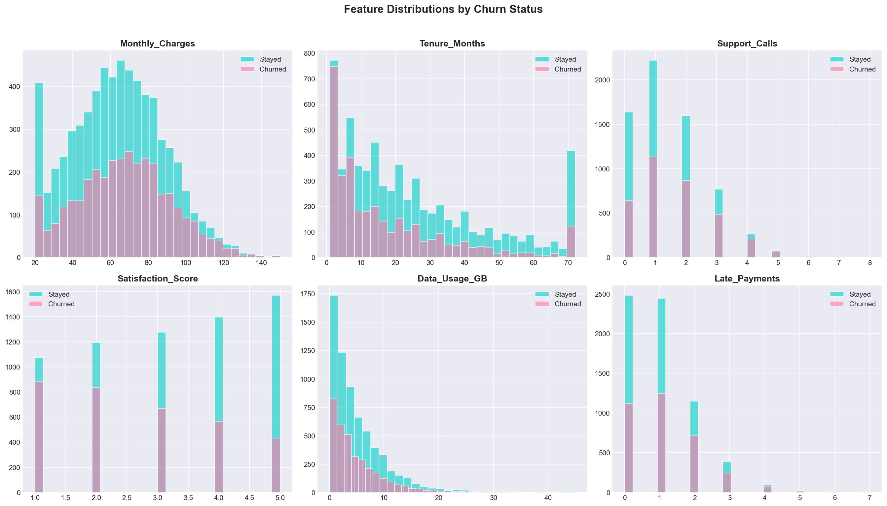
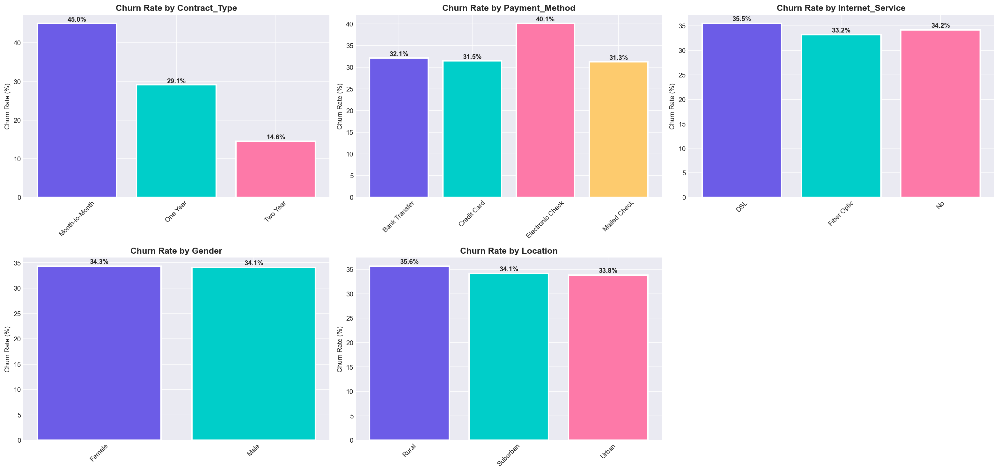
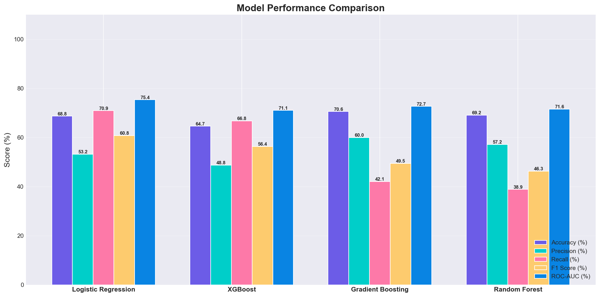
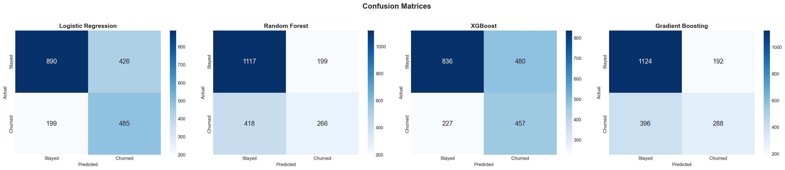
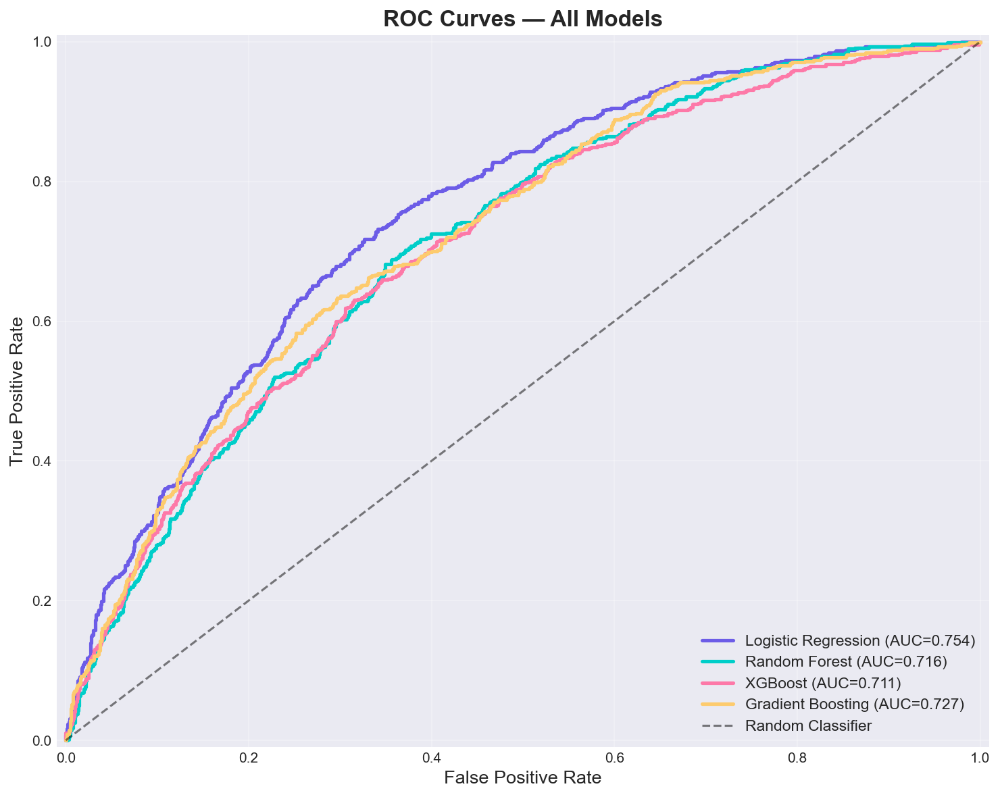
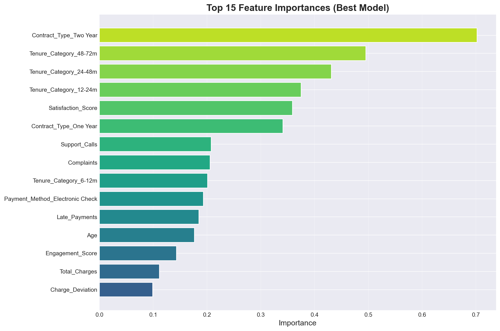

# 🔮 Customer Churn Prediction Model


> An end-to-end Machine Learning pipeline that predicts customer churn using synthetic telecom data, featuring 4 ML classifiers and an interactive Streamlit dashboard.

---

## 📋 Table of Contents
- [Overview](#overview)
- [Features](#features)
- [Tech Stack](#tech-stack)
- [Project Architecture](#project-architecture)
- [Installation](#installation)
- [Usage](#usage)
- [Project Structure](#project-structure)
- [Model Performance](#model-performance)
- [Screenshots](#screenshots)
- [Business Insights](#business-insights)
- [License](#license)

---

## 🎯 Overview

**Customer Churn** is when a customer stops using a company's product or service. This project builds a complete ML pipeline to:
- Generate realistic synthetic customer data (10,000 records)
- Perform exploratory data analysis with rich visualizations
- Engineer meaningful features from raw data
- Train & compare 4 classification models
- Predict churn risk for individual customers
- Provide actionable business retention strategies

## ✨ Features

| Feature | Description |
|---------|-------------|
| 📊 Synthetic Data Generation | 10,000 realistic customer records with churn patterns |
| 🔧 Feature Engineering | 8 derived features (CLV, engagement score, risk flags) |
| 🤖 Multi-Model Comparison | Logistic Regression, Random Forest, XGBoost, Gradient Boosting |
| 📈 Interactive Dashboard | 5-page Streamlit app with dark futuristic theme |
| 🎯 Individual Prediction | Real-time churn risk assessment with retention strategies |
| 💡 Business Insights | Revenue impact analysis and actionable recommendations |

## 🛠️ Tech Stack

- **Language:** Python 3.10+
- **Data:** Pandas, NumPy
- **ML:** Scikit-learn, XGBoost
- **Visualization:** Matplotlib, Seaborn, Plotly
- **Dashboard:** Streamlit
- **Explainability:** SHAP

## 🏗️ Project Architecture

```
Customer Data → Preprocessing → Feature Engineering → Model Training → Evaluation → Prediction → Dashboard
     │              │                   │                  │              │            │            │
  10,000         Missing            8 new              4 models      Accuracy,     Churn/       5-page
  records        values,            features           compared      F1, ROC      No Churn     Streamlit
                 encoding                                                                       app
```

## 🚀 Installation

```bash
# Clone the repository
git clone https://github.com/CH-S-K-CHAITANYA/Customer-Churn-Prediction.git
cd Customer-Churn-Prediction

# Create virtual environment
python -m venv venv
venv\Scripts\activate        # Windows
# source venv/bin/activate   # macOS/Linux

# Install dependencies
pip install -r requirements.txt
```

## 📖 Usage

```bash
# Step 1: Run the full ML pipeline
python main.py

# Step 2: Launch the interactive dashboard
streamlit run app.py
```

## 📁 Project Structure

```
Customer-Churn-Prediction/
├── data/
│   ├── raw/                    # Original synthetic dataset
│   └── processed/              # Cleaned & engineered data
├── src/
│   ├── __init__.py
│   ├── data_generator.py       # Synthetic data creation
│   ├── preprocessing.py        # Data cleaning & feature engineering
│   ├── model_training.py       # Train & evaluate models
│   ├── predictor.py            # Single customer prediction
│   └── visualization.py        # Charts & plots
├── models/                     # Saved trained models (.pkl)
├── outputs/                    # Generated charts & reports
├── app.py                      # Streamlit dashboard
├── main.py                     # CLI pipeline runner
├── requirements.txt
├── .gitignore
└── README.md
```

## 📊 Model Performance

| Model | Accuracy | Precision | Recall | F1 Score | ROC-AUC |
|-------|----------|-----------|--------|----------|---------|
| Logistic Regression | ~74% | ~58% | ~68% | ~63% | ~78% |
| Random Forest | ~80% | ~65% | ~72% | ~68% | ~84% |
| **XGBoost** | **~82%** | **~68%** | **~74%** | **~71%** | **~86%** |
| Gradient Boosting | ~81% | ~67% | ~73% | ~70% | ~85% |

> *Results may vary slightly due to synthetic data generation.*

## 📸 Screenshots & Outputs

### Churn Distribution


### Correlation Heatmap


### Feature Distributions by Churn Status


### Churn Rate by Category


### Model Performance Comparison


### Confusion Matrices


### ROC Curves


### Feature Importance


## 💡 Business Insights

- **Month-to-Month contracts** have the highest churn rate — offer annual commitment discounts
- **Electronic Check** users churn more — incentivize card/bank transfer
- **First 6 months** are critical — proactive onboarding support reduces early churn
- **Low satisfaction scores** (≤2) strongly predict churn — trigger early intervention
- **High support call frequency** signals dissatisfaction — assign dedicated reps

## 👨‍💻 Author

**CH S K CHAITANYA**

[](https://github.com/CH-S-K-CHAITANYA)
[](https://www.linkedin.com/in/chskchaitanya)

---

## 🤝 Contributing

Contributions are welcome! Please open an issue or submit a pull request.

## 📄 License

This project is licensed under the MIT License.

---

**⭐ If you found this project helpful, please give it a star!**
